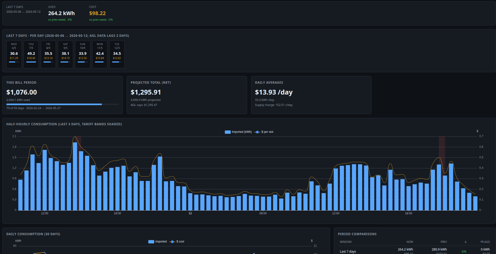

# Haggle webapp

Standalone Python web dashboard for AGL Australia smart-meter data.
Reuses the AGL client from [`custom_components/haggle/agl/`](../custom_components/haggle/agl/)
without pulling in Home Assistant — runs anywhere with Python 3.12+.



```
┌──────────────┐
│  index.html  │  ECharts SPA — bill projection, half-hourly chart with
│  (browser)   │  tariff bands + solar export, daily/weekly/monthly views,
└──────┬───────┘  weekday × half-hour heatmap, 7-day summary strip
       │ JSON
┌──────┴───────┐
│  FastAPI     │  /api/{status, contracts, intervals, daily, bill, plan,
│  (uvicorn)   │   comparisons, heatmap, refresh, backfill, setup/*}
└──────┬───────┘
       │
┌──────┴───────┐  ┌──────────────┐
│  Poller      │──│  AglClient   │  24h fetch + 7-day rewindow self-heal
│  (asyncio)   │  │  (live conn) │  refresh-token rotation persisted
└──────┬───────┘  └──────────────┘
       │
┌──────┴───────┐
│  SQLite      │  ~/.haggle/haggle.db — config, contracts, intervals
│  (WAL)       │  (kwh + cost + kwh_export + credit_aud), plan, bill_period
└──────────────┘
```

---

## Quick start

```bash
./start.sh
```

Open [http://localhost:8000](http://localhost:8000) in your browser. On first
run a 3-step PKCE setup wizard appears — paste back the AGL callback URL,
pick a contract, done. After that the dashboard loads and the poller starts
fetching in the background.

The token rotates on every refresh and is persisted in SQLite, so you stay
authenticated indefinitely. Re-auth is only needed if AGL revokes the
refresh token (very long offline gap, password change), which surfaces as a
clear `auth: …` error in the status line.

---

## Configuration

All env vars are optional; defaults are fine for an Australian household.

| Variable                | Default                       | Purpose                                                     |
|-------------------------|-------------------------------|-------------------------------------------------------------|
| `HAGGLE_HOST`           | `0.0.0.0`                     | Listen address.                                             |
| `HAGGLE_PORT`           | `8000`                        | Listen port.                                                |
| `HAGGLE_DB`             | `~/.haggle/haggle.db`         | SQLite file. Move/back this up to preserve auth + history.  |
| `HAGGLE_TZ_OFFSET`      | `600` (AEST, minutes east UTC)| Used to bucket UTC intervals into local days for the UI.    |
| `HAGGLE_DATA_LAG_DAYS`  | `2`                           | AEMO meter feed lag. Anchors all "last N days" windows.     |

Example:

```bash
HAGGLE_PORT=9000 HAGGLE_DB=/var/lib/haggle.db ./start.sh
```

---

## Features

- **PKCE wizard in the browser** — no terminal needed. Captures the SPKI
  hashes of `secure.agl.com.au` and `api.platform.agl.com.au` for
  Trust-On-First-Use TLS pinning.
- **Solar export** — half-hourly chart shows export as green bars below the
  axis; daily chart stacks import + negative export with a `$ net` line; a
  dedicated Solar card shows cumulative + projected FiT credits. The card
  appears whenever AGL flags the contract `hasSolar`, *or* any historical
  export has been observed, so it doesn't flicker off when the current bill
  period happens to have none.
- **Bill projection** — net of supply charge and FiT credits; averages
  divide by the actual data days (`days_elapsed − HAGGLE_DATA_LAG_DAYS`)
  so projections aren't dragged down by the empty 2-day tail.
- **Period comparisons** — week-over-week, month-over-month, year-over-year,
  all anchored at `today − lag` so we compare fully populated periods.
- **7-day summary + per-day cells** — top of the dashboard. Per-day cells
  show kWh used, $ cost, mini-bar relative to the 7-day max, and a small
  `↓ X kWh` indicator on solar-export days.
- **Backfill** — button in the header. `POST /api/backfill?days=N` (1–60)
  re-fetches the date range from AGL using the live session (no re-auth)
  and idempotently overwrites stored rows. Useful for populating new
  fields (e.g. solar) on rows that pre-date the column being added.
  Throttled and 429-aware.

---

## API

All endpoints return JSON. `?from=YYYY-MM-DD&to=YYYY-MM-DD` parameters are
optional; reasonable defaults apply.

| Method | Path                    | Notes                                                   |
|--------|-------------------------|---------------------------------------------------------|
| GET    | `/`                     | The dashboard HTML.                                     |
| GET    | `/api/status`           | Configured? Last poll? Pin hashes (truncated). Backfill state. |
| GET    | `/api/contracts`        | All discovered AGL contracts on the account.            |
| GET    | `/api/intervals`        | 30-min readings: ts, kwh, cost_aud, rate_type, kwh_export, credit_aud. |
| GET    | `/api/daily`            | Daily totals, local-day bucketed using `HAGGLE_TZ_OFFSET`. |
| GET    | `/api/bill`             | Snapshot from AGL + computed projection (net of solar). |
| GET    | `/api/plan`             | Tariff rates from `/v2/plan/energy/{contract}`.         |
| GET    | `/api/comparisons`      | Week / month, current vs previous vs year-ago.          |
| GET    | `/api/heatmap?weeks=8`  | Average kWh by weekday × half-hour slot.                |
| POST   | `/api/refresh`          | Force one poll cycle now.                               |
| POST   | `/api/backfill?days=30` | Schedule a deep re-fetch (1–60). Background; poll status. |
| GET    | `/api/raw/hourly?day=…` | Debug — raw AGL `/Hourly` JSON for one day.             |
| POST   | `/api/setup/*`          | Three-step PKCE wizard (server-side state).             |

---

## Layout

```
webapp/
├── pyproject.toml          # uv project — fastapi, uvicorn, aiohttp, cryptography
├── start.sh                # uv sync + uv run uvicorn
└── webapp/
    ├── __init__.py
    ├── _bootstrap.py       # imports custom_components/haggle/agl/ without
    │                       # triggering the HA-laden haggle/__init__.py
    ├── auth.py             # CLI fallback for PKCE setup (uv run python -m webapp.auth)
    ├── setup_flow.py       # PKCE helpers shared by the CLI + wizard endpoints
    ├── storage.py          # SQLite schema + idempotent upserts; in-place migrations
    ├── parser_solar.py     # /Hourly JSON → consumption + generation rows
    ├── poller.py           # 24h cycle, 7-day rewindow, on-demand backfill task
    ├── analytics.py        # Bill projection, comparisons, heatmap aggregation
    ├── main.py             # FastAPI app + endpoints + lifespan
    └── static/index.html   # Single-page ECharts dashboard + setup wizard
```

The `_bootstrap.py` shim registers stub `custom_components.haggle` parent
packages before importing `agl/`, so the HA integration's `__init__.py`
(which imports `homeassistant.*`) never runs. This lets the webapp depend
on `aiohttp` + `cryptography` only — no Home Assistant install required.

---

## Relationship to the HA integration

The HA integration in [`custom_components/haggle/`](../custom_components/haggle/)
and this webapp are **independent consumers** of the same AGL client.
Either, neither, or both can run against the same AGL account simultaneously
(they each maintain their own refresh token, so token rotation doesn't
collide as long as you don't trigger both at the exact same moment).

The webapp does **not** modify anything in `custom_components/haggle/` —
all changes for the dashboard live under `webapp/`. The shared
[`agl/`](../custom_components/haggle/agl/) package is treated as a stable
read-only library.

---

## Persistence and security

- **Refresh token** lives in `config` table of the SQLite DB; rotated and
  re-persisted on every Auth0 token exchange. Backups of `~/.haggle/haggle.db`
  preserve auth.
- **Access token** (15 min) is held in process memory only — never
  written to disk.
- **TLS pins** for both AGL hostnames are captured at wizard time and
  validated on every subsequent connection (warn-only on mismatch — see
  the design notes in [`agl/pinning.py`](../custom_components/haggle/agl/pinning.py)).
- **No secrets are logged.** Auth0 / AGL response bodies stay at DEBUG
  level only; URLs containing the contract number are never raised in
  exceptions that surface to the UI.

---

## Stop / start / inspect

```bash
./start.sh                          # foreground
sqlite3 ~/.haggle/haggle.db .schema # peek at the data
sqlite3 ~/.haggle/haggle.db \
   "SELECT date(ts_utc), SUM(kwh), SUM(kwh_export) FROM intervals \
    GROUP BY date(ts_utc) ORDER BY 1 DESC LIMIT 14;"
```

Reset everything (forces re-auth + full backfill on next start):

```bash
rm ~/.haggle/haggle.db
```
